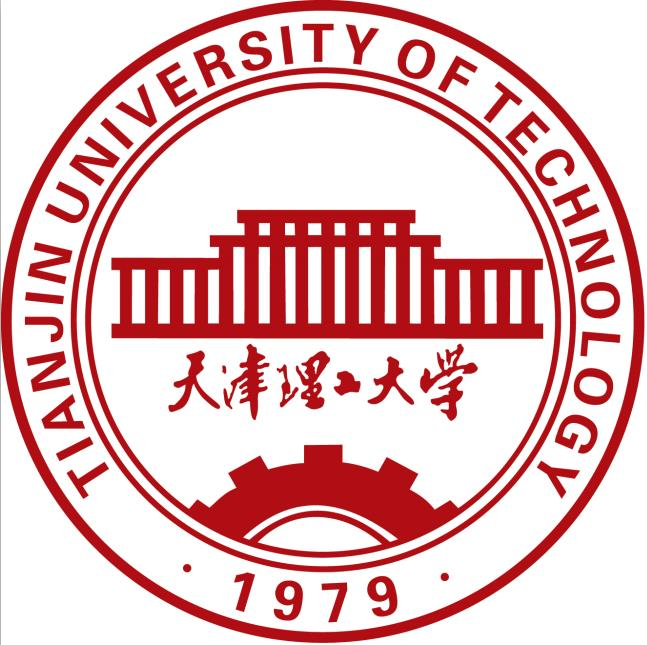

# TUTthesis（天津理工大学硕士学位论文LaTex模板）

# 欢迎使用

本项目旨在创建天津理工大学学位论文的LaTeX模板，为天津理工大学学生的论文撰写提供便利，欢迎各位同学使用并提出您的意见。我们更加欢迎有兴趣的同学贡献您的代码。如果您想参与到这项无私的工作中，请联系ly13063414158@163.com.

# Latex论文模板特色

# Liceense
[MIT](https://github.com/LuYang-2023/TUTthesis/edit/main/LICENSE)

